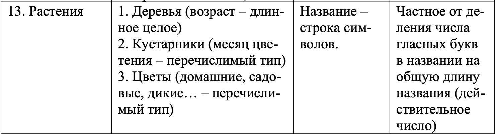
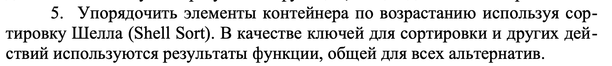
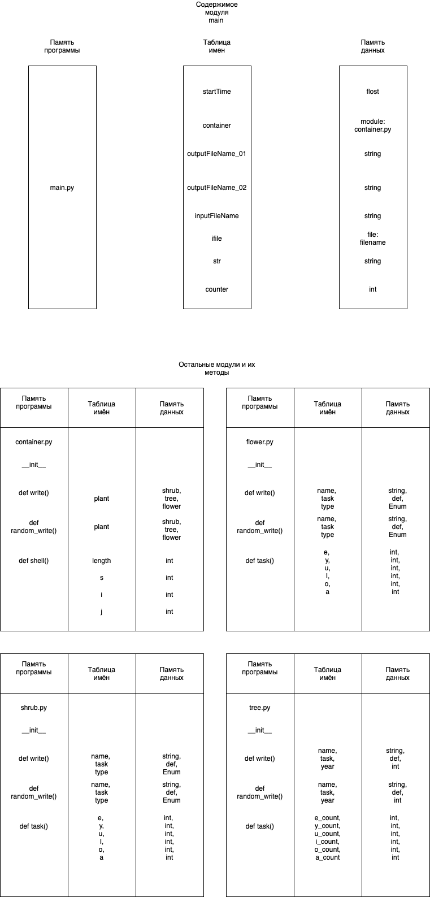

Пояснительная записка 
* Описание задания:  
  Вариант 69  
  Начальное условие задачи:  
    
  Обработка данных в контейнере:  
       

* структурная схема изучаемой архитектуры ВС с размещенной на ней разработанной программы;  
  

* Tребуемые метрики, определяющие характеристики программы, для различных тестовых прогонов.   
  Тесты с  вводом данных:

  Номер теста | Время
    ------------ | -------------
  01 | 2.28ms
  02 | 3.05ms
  03 | 1.448ms
  04 | 2.791ms
  05 | 2.346ms

  
Тесты с рандомной генерацией:

Номер теста | Время | N
------------ | ------------- | -------------
01 | 3.39ms | 1
02 | 2.98ms | 10
03 | 79.07ms | 100
04 | 4743.31ms | 1000
05 | 622277.55ms | 10000
 

* Данные, демонстрирующие сравнение с характеристиками ранее разработанных программ:  
  +Исходный код занимает меньше места. 
  -Программа работает гораздо медленнее(это видно по всем тестам, особенно по крупным). Это связано с переходом на питон, который яввляется интерпретируемым языком.
   
   
* Основные характеристики программы:   
1) Число заголовочных файлов: 7  
2) Число модулей реализации: 7 + main  
4) Размер исходных кодов 11 КБ  